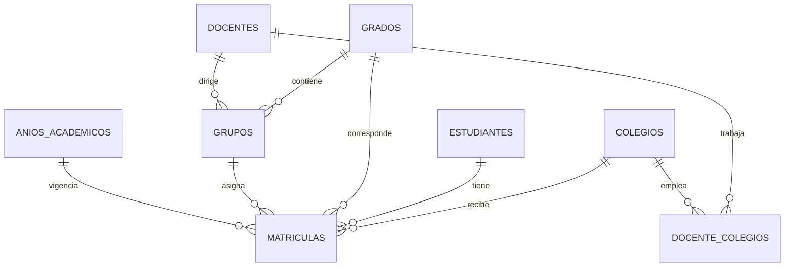

# Modelo Entidad-Relacion

## Diagrama

## Reglas de negocio

1. Un estudiante solo puede tener **una matricula activa** a la vez (un solo colegio).
2. El **historico** se conserva con matriculas inactivas; al renovar puede reactivarse un registro previo o crearse uno nuevo.
3. Un docente puede estar asignado a **varios colegios** simultaneamente (`DocenteColegios`).
4. La **edad** se calcula a partir de `FechaNacimiento`, no se almacena.
5. Cada grupo tiene un **docente director** que atiende a los estudiantes del grupo.

## Consultas del caso de uso

| Consulta | Implementacion |
|---|---|
| Estudiantes 3-7, 8-12, >12 anos | `GET /api/consultas/estudiantes-por-edad` |
| Docentes sector publico/privado | `GET /api/consultas/docentes-por-sector` |
| Colegio con mas estudiantes | `GET /api/consultas/colegio-mayor-matricula` |
| Historico estudiante | `GET /api/estudiantes/{id}/historico` |
